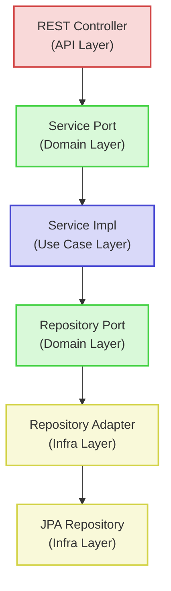

# Architecture

The Event Ticket Management System implements Clean Architecture principles to create a maintainable, testable, and framework-independent application.

## Clean Architecture Overview


The application is structured in layers, with dependencies pointing inward:

1. **Domain Layer (Core)** - Contains business entities and business rules
2. **Use Case Layer (Application)** - Contains application-specific business rules
3. **Interface Adapters** - Convert data between use cases and external formats
4. **Frameworks & Drivers** - External frameworks, databases, and UI components

## Project Structure

```
demo-ticket-service/
├── src/
│   ├── main/
│   │   ├── java/
│   │   │   └── com/ticketmanagement/demo/
│   │   │       ├── api/                # API Layer (Interface Adapters)
│   │   │       │   └── rest/
│   │   │       │       ├── controller/ # REST controllers
│   │   │       │       ├── dto/        # Data Transfer Objects
│   │   │       │       └── mapper/     # Entity-DTO mappers
│   │   │       ├── core/               # Core Domain Layer
│   │   │       │   ├── domain/
│   │   │       │   │   ├── entity/     # Domain entities
│   │   │       │   │   └── exception/  # Domain-specific exceptions
│   │   │       │   ├── port/
│   │   │       │   │   ├── api/        # Service interfaces (inbound)
│   │   │       │   │   └── spi/        # Repository interfaces (outbound)
│   │   │       │   └── usecase/        # Business logic implementations
│   │   │       └── infrastructure/     # Infrastructure Layer (Frameworks & Drivers)
│   │   │           ├── config/         # Application configuration
│   │   │           ├── persistence/    # Database implementation
│   │   │           │   ├── adapter/    # Repository implementations
│   │   │           │   ├── entity/     # JPA entities
│   │   │           │   └── repository/ # Spring Data repositories
│   │   │           └── security/       # Security configuration
│   │   └── resources/
│   │       └── application.properties  # Application configuration
│   └── test/                           # Test classes
└── pom.xml                             # Maven configuration
```

## Key Components

### Core Domain Layer

Contains the business logic and domain entities that are independent of any framework:

- **Domain Entities**: Represent core business concepts (Ticket, Event, User)
- **Domain Exceptions**: Custom exceptions for business rule violations
- **Ports**: Interfaces defining the boundaries between layers
  - **API Ports**: Used by the outer layers to access the use cases
  - **SPI Ports**: Used by the use cases to access external resources

### Use Case Layer

Implements business logic and orchestrates the flow of data:

- **Service Implementations**: Concrete implementations of the service interfaces
- **Base Services**: Abstract services with common functionality

### API Layer

Handles HTTP requests and presents data to clients:

- **Controllers**: REST endpoints that accept and respond to HTTP requests
- **DTOs**: Data Transfer Objects for the API
- **Mappers**: Convert between domain entities and DTOs

### Infrastructure Layer

Contains adapters to external systems and configurations:

- **Repository Adapters**: Implementations of the repository interfaces
- **Security Configuration**: Authentication and authorization setup
- **Persistence Configuration**: Database configuration

## Component Interactions



The diagram above illustrates how components interact across layers in the Clean Architecture pattern.

## Dependency Flow

One of the key principles of Clean Architecture is the dependency rule: dependencies always point inward. In our implementation:

1. The domain layer depends on nothing
2. The use case layer depends only on the domain layer
3. The interface adapters depend on the use case and domain layers
4. The frameworks layer depends on all inner layers

## Ports and Adapters Pattern

The application implements the Ports and Adapters pattern (also known as Hexagonal Architecture):

- **Ports**: Interfaces defined in the core domain layer
- **Adapters**: Implementations of these interfaces in the outer layers

This approach allows for:

1. Easily swapping out implementations (e.g., switching database technologies)
2. Better testability through mocking
3. Clearer separation of concerns

## Technology Stack

- **Spring Boot 3.2.0**: Application framework
- **Spring Security**: Authentication and authorization
- **Spring Data JPA**: Database access layer
- **H2 Database**: In-memory database
- **Lombok**: Reduces boilerplate code
- **Maven**: Build and dependency management